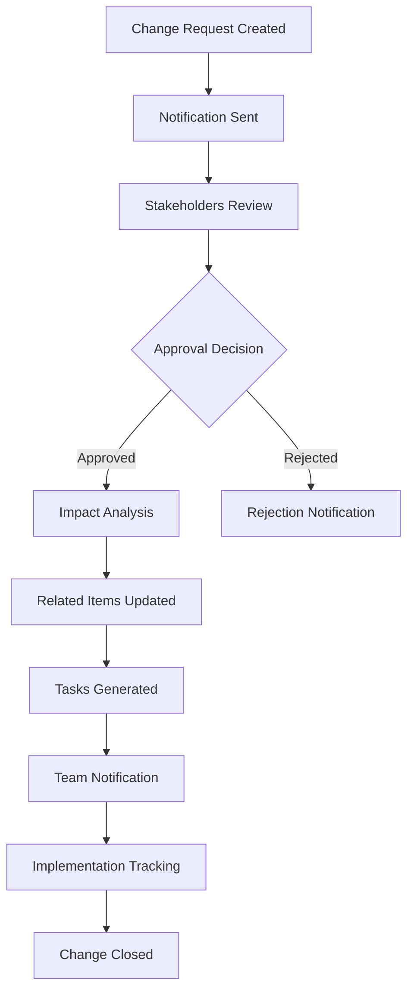

# ProManage UI/UX Design Document

## Document Information

|Document Name|ProManage UI/UX Design Specification|Version|V1.0|
|---|---|---|---|
|Created Date|2024-12-30|Lead Designer|Senior Chief UI/UX Designer|
|Document Status|Design Complete|Last Updated|2024-12-30|
|Project Phase|MVP Development|Review Status|Ready for Implementation|

---

## Table of Contents

1. [Executive Summary](#1-executive-summary)
2. [Design System & Visual Identity](#2-design-system--visual-identity)
3. [User Experience Architecture](#3-user-experience-architecture)
4. [Role-Based Interface Design](#4-role-based-interface-design)
5. [Core Feature UI/UX Design](#5-core-feature-uiux-design)
6. [Mobile Experience Design](#6-mobile-experience-design)
7. [Usability & Performance](#7-usability--performance)
8. [Implementation Guidelines](#8-implementation-guidelines)

---

## 1. Executive Summary

### 1.1 Design Vision

ProManage's UI/UX design embodies **intelligent simplicity** - providing powerful project management capabilities through an intuitive, accessible interface that adapts to each user's role and workflow requirements.

### 1.2 Key Design Principles

- **Role-Adaptive Interface**: Personalized experiences for 7 distinct user types
- **Information Clarity**: Single source of truth with clear visual hierarchy
- **Cognitive Load Reduction**: Progressive disclosure and contextual information
- **Accessibility First**: WCAG 2.1 AA compliance across all interfaces
- **Performance Transparency**: Clear feedback for all operations and states

### 1.3 Target Performance Goals

- **Usability**: <3 clicks for core tasks, 90%+ task success rate
- **Accessibility**: 100% keyboard navigation, screen reader compatible
- **Performance**: <3s page load, <300ms interaction feedback
- **Adoption**: 70%+ daily active usage within 30 days

### 1.4 Technology Alignment

Designed specifically for Vue 3 + TypeScript + Ant Design Vue 4.x stack with:
- Component-based architecture supporting micro-interactions
- Responsive design system for mobile-first development
- Real-time collaboration features with WebSocket integration
- Performance optimization for 500+ concurrent users

---

## 2. Design System & Visual Identity

### 2.1 Visual Identity Foundation

#### Brand Personality
- **Professional**: Clean, organized, trustworthy
- **Intelligent**: Smart automation without complexity
- **Collaborative**: Team-focused, communication-centric
- **Efficient**: Fast, streamlined workflows

#### Color Palette

```css
/* Primary Colors */
--primary-blue: #1890ff;          /* Primary brand color */
--primary-blue-hover: #40a9ff;    /* Interactive states */
--primary-blue-active: #096dd9;   /* Active states */
--primary-blue-light: #e6f7ff;    /* Background highlights */

/* Secondary Colors */
--success-green: #52c41a;         /* Success states */
--warning-orange: #fa8c16;        /* Warning states */
--error-red: #ff4d4f;             /* Error states */
--info-blue: #1890ff;             /* Information states */

/* Neutral Grays */
--gray-100: #f5f5f5;              /* Background light */
--gray-200: #f0f0f0;              /* Borders light */
--gray-300: #d9d9d9;              /* Borders medium */
--gray-400: #bfbfbf;              /* Text disabled */
--gray-500: #8c8c8c;              /* Text secondary */
--gray-600: #595959;              /* Text primary */
--gray-700: #434343;              /* Headings */
--gray-800: #262626;              /* High emphasis text */
--gray-900: #141414;              /* Maximum contrast */

/* Role-Based Accent Colors */
--role-admin: #722ed1;            /* Super Administrator */
--role-pm: #1890ff;               /* Project Manager */
--role-dev: #52c41a;              /* Developer */
--role-test: #fa8c16;             /* Tester */
--role-design: #eb2f96;           /* UI Designer */
--role-ops: #13c2c2;              /* Operations */
--role-external: #8c8c8c;         /* Third-party */
```

#### Typography System

```css
/* Font Families */
--font-family-primary: -apple-system, BlinkMacSystemFont, 'Segoe UI', 'PingFang SC',
                      'Hiragino Sans GB', 'Microsoft YaHei', 'Helvetica Neue',
                      Helvetica, Arial, sans-serif;
--font-family-mono: 'SFMono-Regular', Consolas, 'Liberation Mono', Menlo, Courier, monospace;

/* Typography Scale */
--font-size-xs: 12px;             /* Small labels, captions */
--font-size-sm: 13px;             /* Body text secondary */
--font-size-base: 14px;           /* Body text primary */
--font-size-lg: 16px;             /* Emphasis text */
--font-size-xl: 18px;             /* Section headings */
--font-size-2xl: 20px;            /* Page titles */
--font-size-3xl: 24px;            /* Major headings */
--font-size-4xl: 32px;            /* Hero text */

/* Line Heights */
--line-height-tight: 1.25;        /* Headings */
--line-height-normal: 1.5;        /* Body text */
--line-height-relaxed: 1.625;     /* Long-form content */

/* Font Weights */
--font-weight-normal: 400;
--font-weight-medium: 500;
--font-weight-semibold: 600;
--font-weight-bold: 700;
```

#### Spacing System

```css
/* Spacing Scale (8px base unit) */
--space-1: 4px;    /* xs */
--space-2: 8px;    /* sm */
--space-3: 12px;   /* md-sm */
--space-4: 16px;   /* md */
--space-6: 24px;   /* lg */
--space-8: 32px;   /* xl */
--space-12: 48px;  /* 2xl */
--space-16: 64px;  /* 3xl */
--space-24: 96px;  /* 4xl */

/* Layout Spacing */
--layout-sidebar-width: 240px;
--layout-header-height: 64px;
--layout-content-max-width: 1200px;
--layout-panel-width: 320px;
```

### 2.2 Component Library Specifications

#### Button System

```typescript
// Button Variants
interface ButtonVariants {
  primary: 'primary';    // Main actions
  secondary: 'default';  // Secondary actions
  success: 'success';    // Positive actions
  warning: 'warning';    // Caution actions
  danger: 'danger';      // Destructive actions
  ghost: 'ghost';        // Subtle actions
  link: 'link';          // Text links
}

// Button Sizes
interface ButtonSizes {
  small: 'small';        // 24px height, 12px padding
  medium: 'middle';      // 32px height, 16px padding
  large: 'large';        // 40px height, 20px padding
}
```

#### Input Components

```css
/* Input States */
.ant-input {
  border-radius: 6px;
  transition: all 0.2s ease;

  &:focus {
    border-color: var(--primary-blue);
    box-shadow: 0 0 0 2px var(--primary-blue-light);
  }

  &.error {
    border-color: var(--error-red);
    box-shadow: 0 0 0 2px rgba(255, 77, 79, 0.1);
  }

  &.success {
    border-color: var(--success-green);
    box-shadow: 0 0 0 2px rgba(82, 196, 26, 0.1);
  }
}

/* Form Validation */
.ant-form-item-explain-error {
  color: var(--error-red);
  font-size: var(--font-size-xs);
  line-height: var(--line-height-normal);
}
```

#### Icon System

```typescript
// Icon Categories
interface IconCategories {
  actions: 'edit' | 'delete' | 'copy' | 'share' | 'download' | 'upload';
  navigation: 'back' | 'forward' | 'up' | 'down' | 'left' | 'right';
  status: 'success' | 'warning' | 'error' | 'info' | 'loading';
  content: 'document' | 'image' | 'video' | 'archive' | 'code';
  communication: 'message' | 'notification' | 'mention' | 'comment';
  roles: 'admin' | 'manager' | 'developer' | 'tester' | 'designer' | 'ops';
}

// Icon Usage Guidelines
.icon-primary { color: var(--primary-blue); }
.icon-success { color: var(--success-green); }
.icon-warning { color: var(--warning-orange); }
.icon-error { color: var(--error-red); }
.icon-secondary { color: var(--gray-500); }
```

### 2.3 Responsive Grid System

```css
/* Breakpoints */
--breakpoint-xs: 576px;     /* Small phones */
--breakpoint-sm: 768px;     /* Large phones */
--breakpoint-md: 992px;     /* Tablets */
--breakpoint-lg: 1200px;    /* Desktops */
--breakpoint-xl: 1600px;    /* Large desktops */

/* Grid Container */
.grid-container {
  display: grid;
  grid-template-columns: repeat(12, 1fr);
  gap: var(--space-4);
  max-width: var(--layout-content-max-width);
  margin: 0 auto;
  padding: 0 var(--space-4);
}

/* Responsive Grid Classes */
.col-12 { grid-column: span 12; }
.col-6 { grid-column: span 6; }
.col-4 { grid-column: span 4; }
.col-3 { grid-column: span 3; }

@media (max-width: 768px) {
  .col-md-12 { grid-column: span 12; }
  .col-md-6 { grid-column: span 6; }
}
```

---

## 3. User Experience Architecture

### 3.1 Information Architecture

#### Site Map Structure

```
ProManage Application
├── Authentication
│   ├── Login
│   ├── Register
│   └── Password Reset
├── Dashboard (Role-specific)
│   ├── My Workspace
│   ├── Quick Actions
│   ├── Recent Activity
│   └── Notifications
├── Projects
│   ├── Project List
│   ├── Project Details
│   │   ├── Overview
│   │   ├── Documents
│   │   ├── Tasks
│   │   ├── Changes
│   │   ├── Tests
│   │   └── Team
│   └── Project Settings
├── Knowledge Base
│   ├── Document Library
│   ├── Search & Filter
│   ├── Document Details
│   └── Version History
├── Task Management
│   ├── Task Board
│   ├── Task List
│   ├── Task Details
│   └── Dependencies
├── Change Management
│   ├── Change Requests
│   ├── Change Details
│   ├── Approval Workflow
│   └── Impact Analysis
├── Test Management
│   ├── Test Suites
│   ├── Test Cases
│   ├── Test Execution
│   └── Test Reports
├── Collaboration
│   ├── Notifications
│   ├── Comments & Reviews
│   ├── Real-time Updates
│   └── Activity Timeline
├── Analytics & Reports
│   ├── Project Analytics
│   ├── Team Performance
│   ├── Change Impact
│   └── Custom Reports
└── Administration
    ├── User Management
    ├── Role & Permissions
    ├── System Settings
    └── Audit Logs
```

#### Navigation Patterns

**Primary Navigation (Global)**
- Top navigation bar with user context and global actions
- Left sidebar with main sections (collapsible)
- Breadcrumb navigation for deep hierarchies
- Global search with intelligent suggestions

**Secondary Navigation (Contextual)**
- Tab navigation within main sections
- Filter and sort controls
- Pagination for large datasets
- Quick action floating buttons

### 3.2 User Journey Mapping

#### Core User Journey: Change Request Management



**UX Touchpoints:**
1. **Creation**: Smart form with impact prediction
2. **Review**: Clear presentation of changes and impacts
3. **Approval**: Simple approve/reject with comments
4. **Analysis**: Visual impact map and affected items
5. **Implementation**: Progress tracking and updates
6. **Closure**: Summary and lessons learned

### 3.3 Workflow Design Patterns

#### Progressive Disclosure Pattern

```typescript
// Example: Document Upload Workflow
interface UploadWorkflow {
  step1: 'File Selection';     // Basic file chooser
  step2: 'Metadata Entry';     // Expandable metadata form
  step3: 'Categorization';     // Smart tagging suggestions
  step4: 'Permissions';        // Role-based access settings
  step5: 'Review & Confirm';   // Summary with preview
}
```

#### Smart Defaults Pattern

```typescript
// Example: Task Creation with Smart Defaults
interface TaskDefaults {
  assignee: 'Based on similar tasks';
  priority: 'Inferred from project phase';
  dueDate: 'Calculated from dependencies';
  tags: 'Suggested from project context';
  linkedDocs: 'Auto-detected from description';
}
```

### 3.4 Accessibility Considerations

#### WCAG 2.1 AA Compliance

**Color & Contrast**
- Minimum 4.5:1 contrast ratio for normal text
- Minimum 3:1 contrast ratio for large text and icons
- Color is never the only means of conveying information

**Keyboard Navigation**
- All interactive elements accessible via keyboard
- Clear focus indicators with 2px outline
- Logical tab order following visual layout
- Skip links for efficient navigation

**Screen Reader Support**
- Semantic HTML structure with proper ARIA labels
- Alternative text for all images and icons
- Form labels properly associated with inputs
- Live regions for dynamic content updates

**Motor Accessibility**
- Minimum 44px touch targets on mobile
- Generous click areas for buttons and links
- Drag and drop alternatives available
- No time-sensitive interactions required

#### Accessibility Testing Checklist

```typescript
interface A11yChecklist {
  colorContrast: 'WCAG AA compliance verified';
  keyboardNav: 'All functions keyboard accessible';
  screenReader: 'NVDA/JAWS/VoiceOver compatible';
  focusManagement: 'Clear focus indicators implemented';
  semanticHTML: 'Proper heading structure and landmarks';
  altText: 'Descriptive alternative text provided';
  formLabels: 'All form elements properly labeled';
  liveRegions: 'Dynamic updates announced properly';
}
```

---

## 4. Role-Based Interface Design

### 4.1 Super Administrator Interface

#### Dashboard Layout

```html
<!-- Super Admin Dashboard Structure -->
<div class="admin-dashboard">
  <div class="dashboard-header">
    <h1>System Administration</h1>
    <div class="quick-stats">
      <StatCard title="Total Users" value="1,247" trend="+5.2%" />
      <StatCard title="Active Projects" value="89" trend="+2.1%" />
      <StatCard title="System Health" value="99.9%" status="excellent" />
      <StatCard title="Storage Used" value="2.3TB" limit="5TB" />
    </div>
  </div>

  <div class="dashboard-content">
    <div class="management-grid">
      <QuickActions>
        <Action title="User Management" icon="user" route="/admin/users" />
        <Action title="System Settings" icon="settings" route="/admin/settings" />
        <Action title="Audit Logs" icon="audit" route="/admin/audit" />
        <Action title="Backup & Recovery" icon="backup" route="/admin/backup" />
      </QuickActions>

      <SystemMonitoring>
        <ServerStatus />
        <DatabaseHealth />
        <SecurityAlerts />
      </SystemMonitoring>

      <UserActivity>
        <RecentLogins />
        <PermissionChanges />
        <SystemUsage />
      </UserActivity>
    </div>
  </div>
</div>
```

#### Key Interface Features

**System Overview Panel**
- Real-time system metrics and health indicators
- Resource usage monitoring (CPU, memory, storage)
- Security alerts and compliance status
- Performance analytics with drill-down capabilities

**User Management Interface**
- Bulk user operations with confirmation dialogs
- Role assignment with visual permission matrix
- User activity timeline and audit trail
- Advanced filtering and search capabilities

**System Configuration**
- Feature toggles with impact assessment
- Integration settings with testing tools
- Backup and recovery management
- License and billing information

### 4.2 Project Manager Interface

#### Dashboard Layout

```html
<!-- Project Manager Dashboard Structure -->
<div class="pm-dashboard">
  <div class="project-overview">
    <h1>Project Portfolio</h1>
    <div class="project-cards">
      <ProjectCard
        v-for="project in projects"
        :project="project"
        :key="project.id"
        @click="navigateToProject"
      >
        <ProjectHealth :metrics="project.health" />
        <RecentActivity :activities="project.recentActivity" />
        <TeamStatus :team="project.team" />
      </ProjectCard>
    </div>
  </div>

  <div class="management-tools">
    <div class="resource-planning">
      <TeamCapacity />
      <MilestoneTracker />
      <RiskAssessment />
    </div>

    <div class="change-management">
      <PendingApprovals />
      <ChangeImpactSummary />
      <ApprovalWorkflow />
    </div>
  </div>
</div>
```

#### Key Interface Features

**Project Portfolio View**
- Visual project health indicators with color coding
- Resource allocation and capacity planning tools
- Cross-project dependency visualization
- Budget tracking and forecasting

**Team Coordination Hub**
- Team workload distribution charts
- Skill matrix and resource planning
- Communication channel integration
- Meeting scheduler with availability

**Change Management Workflow**
- Approval queue with priority sorting
- Impact analysis visualization
- Decision tracking and documentation
- Stakeholder notification system

### 4.3 Developer Interface

#### Dashboard Layout

```html
<!-- Developer Dashboard Structure -->
<div class="dev-dashboard">
  <div class="development-workspace">
    <h1>My Development Workspace</h1>

    <div class="task-overview">
      <TaskBoard
        :columns="['Todo', 'In Progress', 'Review', 'Done']"
        :tasks="assignedTasks"
        @task-update="handleTaskUpdate"
      />
    </div>

    <div class="quick-access">
      <RecentDocuments />
      <CodeRepositories />
      <TestResults />
    </div>
  </div>

  <div class="development-tools">
    <DocumentationPanel />
    <ChangeNotifications />
    <CollaborationChat />
  </div>
</div>
```

#### Key Interface Features

**Development Task Board**
- Kanban-style task management with drag-and-drop
- Task filtering by priority, deadline, and type
- Time tracking integration with automatic logging
- Dependency visualization and blocking issue alerts

**Documentation Quick Access**
- Recently accessed documents with preview
- Smart document recommendations based on current tasks
- Full-text search with code snippet highlighting
- Version comparison tools for specifications

**Change Impact Notifications**
- Real-time notifications for relevant changes
- Impact assessment with affected code areas
- Change timeline with developer-specific context
- Integration with code review tools

### 4.4 Tester Interface

#### Dashboard Layout

```html
<!-- Tester Dashboard Structure -->
<div class="tester-dashboard">
  <div class="testing-workspace">
    <h1>Testing Control Center</h1>

    <div class="test-execution">
      <TestSuiteRunner />
      <ExecutionResults />
      <DefectTracking />
    </div>

    <div class="test-management">
      <TestCaseLibrary />
      <CoverageAnalysis />
      <ChangeImpactTests />
    </div>
  </div>

  <div class="quality-metrics">
    <QualityDashboard />
    <TestAutomation />
    <RegressionSuite />
  </div>
</div>
```

#### Key Interface Features

**Test Case Management**
- Reusable test case library with 70%+ reuse target
- Smart test case recommendations based on changes
- Test case versioning and approval workflow
- Bulk operations for test suite maintenance

**Execution Tracking**
- Real-time test execution monitoring
- Visual test coverage analysis with heat maps
- Defect correlation and root cause analysis
- Automated regression test scheduling

**Change Impact Testing**
- Automatic test case generation from change requests
- Impact-based test prioritization
- Change-to-test traceability matrix
- Risk-based testing recommendations

### 4.5 UI Designer Interface

#### Dashboard Layout

```html
<!-- UI Designer Dashboard Structure -->
<div class="designer-dashboard">
  <div class="design-workspace">
    <h1>Design Studio</h1>

    <div class="design-projects">
      <DesignProjectCard
        v-for="project in designProjects"
        :project="project"
        :key="project.id"
      >
        <DesignPreview :assets="project.assets" />
        <FeedbackSummary :feedback="project.feedback" />
        <VersionHistory :versions="project.versions" />
      </DesignProjectCard>
    </div>

    <div class="design-tools">
      <AssetLibrary />
      <StyleGuideManager />
      <PrototypeViewer />
    </div>
  </div>

  <div class="collaboration-hub">
    <FeedbackCollection />
    <DesignReviews />
    <DeveloperHandoff />
  </div>
</div>
```

#### Key Interface Features

**Design Asset Management**
- Version-controlled design file storage
- Asset categorization and tagging system
- Design system component library
- Integration with Figma and other design tools

**Feedback Collection System**
- Visual annotation tools for precise feedback
- Stakeholder review workflow with approvals
- Feedback consolidation and prioritization
- Change tracking from feedback to implementation

**Developer Handoff Tools**
- Design specification generation
- Asset export in multiple formats
- CSS code generation from designs
- Implementation progress tracking

### 4.6 Operations Interface

#### Dashboard Layout

```html
<!-- Operations Dashboard Structure -->
<div class="ops-dashboard">
  <div class="operations-center">
    <h1>Operations Command Center</h1>

    <div class="deployment-status">
      <EnvironmentOverview />
      <DeploymentPipeline />
      <SystemHealth />
    </div>

    <div class="documentation">
      <RunbookLibrary />
      <DeploymentGuides />
      <TroubleshootingDocs />
    </div>
  </div>

  <div class="monitoring-tools">
    <AlertDashboard />
    <PerformanceMetrics />
    <CapacityPlanning />
  </div>
</div>
```

#### Key Interface Features

**Deployment Management**
- Environment status with real-time monitoring
- Deployment pipeline visualization
- Rollback capabilities with safety checks
- Configuration management tools

**Documentation Hub**
- Runbook management with search and categorization
- Step-by-step deployment guides
- Troubleshooting knowledge base
- Incident response procedures

**Monitoring & Alerting**
- Real-time system health dashboards
- Custom alert configuration
- Performance trend analysis
- Capacity planning tools

### 4.7 Third-party Personnel Interface

#### Dashboard Layout

```html
<!-- Third-party Dashboard Structure -->
<div class="external-dashboard">
  <div class="limited-workspace">
    <h1>Project Collaboration</h1>

    <div class="accessible-content">
      <SharedDocuments />
      <AssignedTasks />
      <CommunicationLog />
    </div>

    <div class="collaboration-tools">
      <MessageCenter />
      <FileSharing />
      <MeetingNotes />
    </div>
  </div>

  <div class="security-notice">
    <AccessLimitations />
    <DataHandlingGuidelines />
    <ComplianceReminders />
  </div>
</div>
```

#### Key Interface Features

**Restricted Access Design**
- Clear indication of access limitations
- Role-appropriate content filtering
- Watermarked document viewing
- Activity logging and audit trail

**Secure Collaboration**
- Time-limited access sessions
- Download restrictions with approval workflow
- Secure messaging with encryption
- Meeting recording restrictions

**Compliance Interface**
- Data handling agreement display
- Regular compliance reminders
- Access request workflow
- Security training integration

---

## 5. Core Feature UI/UX Design

### 5.1 Document Management Interface

#### Document Library Layout

```html
<!-- Document Library Structure -->
<div class="document-library">
  <div class="library-header">
    <div class="breadcrumb-nav">
      <Breadcrumb>
        <BreadcrumbItem href="/">Home</BreadcrumbItem>
        <BreadcrumbItem href="/projects">Projects</BreadcrumbItem>
        <BreadcrumbItem>Documents</BreadcrumbItem>
      </Breadcrumb>
    </div>

    <div class="library-actions">
      <SearchInput
        placeholder="Search documents..."
        :suggestions="searchSuggestions"
        @search="handleSearch"
      />
      <UploadButton @click="showUploadModal" />
      <CreateDocumentButton @click="createDocument" />
      <ViewToggle v-model="viewMode" :options="['grid', 'list', 'tree']" />
    </div>
  </div>

  <div class="library-content">
    <div class="filter-sidebar">
      <FilterPanel>
        <FilterSection title="Document Type">
          <CheckboxGroup v-model="filters.types" :options="documentTypes" />
        </FilterSection>
        <FilterSection title="Modified Date">
          <DateRangeSelector v-model="filters.dateRange" />
        </FilterSection>
        <FilterSection title="Author">
          <UserSelector v-model="filters.authors" multiple />
        </FilterSection>
        <FilterSection title="Tags">
          <TagSelector v-model="filters.tags" />
        </FilterSection>
      </FilterPanel>
    </div>

    <div class="document-grid">
      <DocumentCard
        v-for="document in filteredDocuments"
        :key="document.id"
        :document="document"
        @click="openDocument"
        @star="toggleStar"
        @share="showShareDialog"
      >
        <DocumentPreview :document="document" />
        <DocumentMeta :document="document" />
        <DocumentActions :document="document" />
      </DocumentCard>
    </div>
  </div>
</div>
```

#### Document Viewer Interface

```html
<!-- Document Viewer Structure -->
<div class="document-viewer">
  <div class="viewer-header">
    <div class="document-info">
      <h1>{{ document.title }}</h1>
      <DocumentBadges :document="document" />
      <LastModified :timestamp="document.updatedAt" :author="document.updatedBy" />
    </div>

    <div class="viewer-actions">
      <EditButton v-if="canEdit" @click="enterEditMode" />
      <ShareButton @click="showShareDialog" />
      <VersionHistoryButton @click="showVersionHistory" />
      <DownloadButton @click="downloadDocument" />
      <BookmarkButton :bookmarked="document.isBookmarked" @toggle="toggleBookmark" />
    </div>
  </div>

  <div class="viewer-content">
    <div class="document-content">
      <RichTextViewer
        v-if="document.type === 'text'"
        :content="document.content"
        :readonly="!isEditing"
        @change="handleContentChange"
      />
      <PDFViewer
        v-else-if="document.type === 'pdf'"
        :src="document.url"
        :annotations="document.annotations"
        @annotate="addAnnotation"
      />
      <ImageViewer
        v-else-if="document.type === 'image'"
        :src="document.url"
        :metadata="document.metadata"
      />
    </div>

    <div class="document-sidebar">
      <RelatedDocuments :documents="relatedDocs" />
      <DocumentComments :comments="document.comments" @add-comment="addComment" />
      <DocumentActivity :activities="document.activities" />
    </div>
  </div>
</div>
```

#### Key UX Features

**Intelligent Search & Discovery**
- Auto-complete with smart suggestions
- Faceted search with real-time filtering
- Visual search results with previews
- Recent searches and popular documents

**Version Control Interface**
- Visual diff viewer with side-by-side comparison
- Version timeline with branching visualization
- One-click rollback with confirmation
- Change annotations and comments

**Collaborative Editing**
- Real-time cursor tracking and user presence
- Conflict resolution with merge suggestions
- Comment and suggestion system
- Lock management for critical sections

### 5.2 Task Management Interface

#### Task Board Layout

```html
<!-- Task Board Structure -->
<div class="task-board">
  <div class="board-header">
    <div class="board-title">
      <h1>{{ project.name }} - Task Board</h1>
      <ProjectStatusBadge :status="project.status" />
    </div>

    <div class="board-controls">
      <ViewModeToggle v-model="viewMode" :options="['board', 'list', 'timeline']" />
      <FilterButton @click="showFilters" :active="hasActiveFilters" />
      <GroupBySelector v-model="groupBy" :options="groupOptions" />
      <CreateTaskButton @click="createTask" />
    </div>
  </div>

  <div class="board-filters" v-show="showFilters">
    <QuickFilters>
      <FilterChip label="My Tasks" :active="filters.assignedToMe" @toggle="toggleMyTasks" />
      <FilterChip label="High Priority" :active="filters.highPriority" @toggle="toggleHighPriority" />
      <FilterChip label="Due This Week" :active="filters.dueThisWeek" @toggle="toggleDueThisWeek" />
      <FilterChip label="Blocked" :active="filters.blocked" @toggle="toggleBlocked" />
    </QuickFilters>

    <AdvancedFilters>
      <FilterGroup title="Assignee">
        <UserMultiSelect v-model="filters.assignees" :users="projectTeam" />
      </FilterGroup>
      <FilterGroup title="Labels">
        <LabelMultiSelect v-model="filters.labels" :labels="projectLabels" />
      </FilterGroup>
      <FilterGroup title="Due Date">
        <DateRangeSelector v-model="filters.dueDateRange" />
      </FilterGroup>
    </AdvancedFilters>
  </div>

  <div class="board-columns">
    <TaskColumn
      v-for="column in columns"
      :key="column.id"
      :column="column"
      :tasks="getColumnTasks(column.id)"
      @task-drop="handleTaskMove"
      @create-task="createTaskInColumn"
    >
      <TaskCard
        v-for="task in getColumnTasks(column.id)"
        :key="task.id"
        :task="task"
        @click="openTaskDetails"
        @quick-edit="enableQuickEdit"
        draggable
      >
        <TaskHeader :task="task" />
        <TaskDescription :task="task" />
        <TaskFooter :task="task" />
      </TaskCard>
    </TaskColumn>
  </div>
</div>
```

#### Task Details Modal

```html
<!-- Task Details Structure -->
<div class="task-details-modal">
  <div class="task-header">
    <div class="task-title">
      <EditableText
        v-model="task.title"
        :readonly="!canEdit"
        placeholder="Task title..."
        @save="updateTaskTitle"
      />
      <TaskStatusBadge :status="task.status" @change="updateTaskStatus" />
    </div>

    <div class="task-actions">
      <StarButton :starred="task.isStarred" @toggle="toggleStar" />
      <ShareButton @click="shareTask" />
      <MoreActionsMenu>
        <MenuItem @click="duplicateTask">Duplicate</MenuItem>
        <MenuItem @click="convertToSubtask">Convert to Subtask</MenuItem>
        <MenuItem @click="archiveTask" v-if="canArchive">Archive</MenuItem>
        <MenuItem @click="deleteTask" danger v-if="canDelete">Delete</MenuItem>
      </MoreActionsMenu>
    </div>
  </div>

  <div class="task-content">
    <div class="task-main">
      <div class="task-description">
        <SectionHeader title="Description" />
        <RichTextEditor
          v-model="task.description"
          :readonly="!canEdit"
          placeholder="Add a description..."
          @save="updateTaskDescription"
        />
      </div>

      <div class="task-subtasks">
        <SectionHeader title="Subtasks" :count="task.subtasks.length" />
        <SubtaskList
          :subtasks="task.subtasks"
          @add="addSubtask"
          @update="updateSubtask"
          @delete="deleteSubtask"
        />
      </div>

      <div class="task-attachments">
        <SectionHeader title="Attachments" :count="task.attachments.length" />
        <AttachmentList
          :attachments="task.attachments"
          @upload="uploadAttachment"
          @download="downloadAttachment"
          @delete="deleteAttachment"
        />
      </div>

      <div class="task-comments">
        <SectionHeader title="Comments" :count="task.comments.length" />
        <CommentList
          :comments="task.comments"
          @add="addComment"
          @edit="editComment"
          @delete="deleteComment"
        />
      </div>
    </div>

    <div class="task-sidebar">
      <TaskProperties>
        <PropertyItem label="Assignee">
          <UserSelector
            v-model="task.assignee"
            :users="projectTeam"
            @change="updateAssignee"
          />
        </PropertyItem>

        <PropertyItem label="Due Date">
          <DatePicker
            v-model="task.dueDate"
            @change="updateDueDate"
          />
        </PropertyItem>

        <PropertyItem label="Priority">
          <PrioritySelector
            v-model="task.priority"
            @change="updatePriority"
          />
        </PropertyItem>

        <PropertyItem label="Labels">
          <LabelMultiSelect
            v-model="task.labels"
            :labels="availableLabels"
            @change="updateLabels"
          />
        </PropertyItem>

        <PropertyItem label="Story Points">
          <StoryPointSelector
            v-model="task.storyPoints"
            @change="updateStoryPoints"
          />
        </PropertyItem>
      </TaskProperties>

      <TaskRelationships>
        <RelationshipSection title="Blocked By" :tasks="task.blockedBy" />
        <RelationshipSection title="Blocks" :tasks="task.blocks" />
        <RelationshipSection title="Related To" :tasks="task.relatedTo" />
        <RelationshipSection title="Parent Task" :task="task.parent" />
      </TaskRelationships>

      <TaskActivity>
        <ActivityTimeline :activities="task.activities" />
      </TaskActivity>
    </div>
  </div>
</div>
```

#### Key UX Features

**Drag & Drop Task Management**
- Smooth animations with visual feedback
- Auto-scroll when dragging near edges
- Bulk selection and movement
- Undo/redo for accidental moves

**Smart Task Creation**
- Template-based task creation
- Auto-fill from project context
- Dependency detection and suggestions
- Bulk task import from spreadsheets

**Progress Visualization**
- Burndown charts with projections
- Velocity tracking and predictions
- Dependency graph visualization
- Custom dashboard widgets

### 5.3 Change Management Interface

#### Change Request List

```html
<!-- Change Request List Structure -->
<div class="change-request-list">
  <div class="list-header">
    <div class="header-title">
      <h1>Change Requests</h1>
      <ChangeRequestStats :stats="stats" />
    </div>

    <div class="header-actions">
      <SearchInput
        placeholder="Search change requests..."
        v-model="searchQuery"
        @search="performSearch"
      />
      <FilterMenu @apply="applyFilters" />
      <SortMenu v-model="sortBy" :options="sortOptions" />
      <CreateChangeRequestButton @click="createChangeRequest" />
    </div>
  </div>

  <div class="list-filters">
    <StatusFilter v-model="statusFilter" :statuses="changeStatuses" />
    <PriorityFilter v-model="priorityFilter" :priorities="priorities" />
    <DateRangeFilter v-model="dateFilter" />
    <AssigneeFilter v-model="assigneeFilter" :users="projectTeam" />
  </div>

  <div class="list-content">
    <ChangeRequestTable
      :requests="filteredRequests"
      :columns="tableColumns"
      @row-click="openChangeRequest"
      @status-change="updateStatus"
      @bulk-action="handleBulkAction"
    >
      <template #status="{ record }">
        <StatusBadge :status="record.status" :workflow="changeWorkflow" />
      </template>

      <template #priority="{ record }">
        <PriorityIndicator :priority="record.priority" />
      </template>

      <template #impact="{ record }">
        <ImpactSummary :impact="record.impactAnalysis" />
      </template>

      <template #actions="{ record }">
        <ActionMenu>
          <MenuItem @click="approveRequest(record)" v-if="canApprove(record)">
            Approve
          </MenuItem>
          <MenuItem @click="rejectRequest(record)" v-if="canReject(record)">
            Reject
          </MenuItem>
          <MenuItem @click="editRequest(record)" v-if="canEdit(record)">
            Edit
          </MenuItem>
          <MenuItem @click="duplicateRequest(record)">
            Duplicate
          </MenuItem>
        </ActionMenu>
      </template>
    </ChangeRequestTable>
  </div>
</div>
```

#### Change Request Details

```html
<!-- Change Request Details Structure -->
<div class="change-request-details">
  <div class="request-header">
    <div class="request-title">
      <h1>{{ changeRequest.title }}</h1>
      <StatusBadge :status="changeRequest.status" large />
      <PriorityBadge :priority="changeRequest.priority" />
    </div>

    <div class="request-actions">
      <ApprovalActions
        v-if="canApprove"
        :request="changeRequest"
        @approve="approveRequest"
        @reject="rejectRequest"
        @request-changes="requestChanges"
      />
      <EditButton v-if="canEdit" @click="editRequest" />
      <ShareButton @click="shareRequest" />
      <ExportButton @click="exportRequest" />
    </div>
  </div>

  <div class="request-content">
    <div class="request-main">
      <div class="change-summary">
        <SectionHeader title="Change Summary" />
        <ChangeDescription :description="changeRequest.description" />
        <ChangeMeta :meta="changeRequest.metadata" />
      </div>

      <div class="impact-analysis">
        <SectionHeader title="Impact Analysis" />
        <ImpactVisualization :analysis="changeRequest.impactAnalysis" />
        <AffectedItems :items="changeRequest.affectedItems" />
        <RiskAssessment :risks="changeRequest.risks" />
      </div>

      <div class="implementation-plan">
        <SectionHeader title="Implementation Plan" />
        <TaskBreakdown :tasks="changeRequest.implementationTasks" />
        <Timeline :timeline="changeRequest.timeline" />
        <ResourceRequirements :resources="changeRequest.resources" />
      </div>

      <div class="approval-workflow">
        <SectionHeader title="Approval Workflow" />
        <WorkflowVisualization :workflow="changeRequest.workflow" />
        <ApprovalHistory :history="changeRequest.approvalHistory" />
      </div>
    </div>

    <div class="request-sidebar">
      <ChangeProperties>
        <PropertyItem label="Requestor">
          <UserAvatar :user="changeRequest.requestor" />
        </PropertyItem>

        <PropertyItem label="Created">
          <DateTime :timestamp="changeRequest.createdAt" />
        </PropertyItem>

        <PropertyItem label="Target Date">
          <DatePicker
            v-model="changeRequest.targetDate"
            :readonly="!canEdit"
            @change="updateTargetDate"
          />
        </PropertyItem>

        <PropertyItem label="Business Justification">
          <TextArea
            v-model="changeRequest.businessJustification"
            :readonly="!canEdit"
            @change="updateJustification"
          />
        </PropertyItem>

        <PropertyItem label="Stakeholders">
          <StakeholderList
            :stakeholders="changeRequest.stakeholders"
            @add="addStakeholder"
            @remove="removeStakeholder"
          />
        </PropertyItem>
      </ChangeProperties>

      <RelatedChanges :changes="relatedChanges" />

      <ChangeActivity>
        <ActivityTimeline :activities="changeRequest.activities" />
      </ChangeActivity>
    </div>
  </div>
</div>
```

#### Key UX Features

**Intelligent Impact Analysis**
- Visual impact map with dependency trees
- Automated affected item detection
- Risk scoring with mitigation suggestions
- Cost and effort estimation tools

**Streamlined Approval Workflow**
- Clear approval status indicators
- Parallel and sequential approval paths
- Delegation and escalation features
- Bulk approval for related changes

**Change Tracking & Audit**
- Complete change history timeline
- Before/after comparisons
- Implementation progress tracking
- Post-implementation review

### 5.4 Search & Discovery Experience

#### Global Search Interface

```html
<!-- Global Search Structure -->
<div class="global-search">
  <div class="search-input-container">
    <SearchInput
      v-model="searchQuery"
      placeholder="Search across all projects..."
      :suggestions="searchSuggestions"
      @search="performSearch"
      @suggestion-select="selectSuggestion"
    >
      <template #prefix>
        <SearchIcon />
      </template>

      <template #suffix>
        <FilterButton @click="showAdvancedFilters" />
        <VoiceSearchButton @click="startVoiceSearch" />
      </template>
    </SearchInput>

    <SearchSuggestions
      v-show="showSuggestions"
      :suggestions="searchSuggestions"
      :query="searchQuery"
      @select="selectSuggestion"
    />
  </div>

  <div class="advanced-filters" v-show="showAdvancedFilters">
    <FilterSection title="Content Type">
      <CheckboxGroup v-model="filters.contentTypes" :options="contentTypes" />
    </FilterSection>

    <FilterSection title="Project">
      <ProjectSelector v-model="filters.projects" multiple />
    </FilterSection>

    <FilterSection title="Date Range">
      <DateRangeSelector v-model="filters.dateRange" />
    </FilterSection>

    <FilterSection title="Author">
      <UserSelector v-model="filters.authors" multiple />
    </FilterSection>
  </div>

  <div class="search-results">
    <div class="results-header">
      <div class="results-count">
        {{ searchResults.total }} results for "{{ searchQuery }}"
      </div>

      <div class="results-controls">
        <SortSelector v-model="sortBy" :options="sortOptions" />
        <ViewToggle v-model="viewMode" :options="['list', 'grid', 'timeline']" />
      </div>
    </div>

    <div class="results-filters">
      <ResultsCategoryFilter
        :categories="resultCategories"
        v-model="selectedCategories"
      />
    </div>

    <div class="results-content">
      <SearchResultItem
        v-for="result in searchResults.items"
        :key="result.id"
        :result="result"
        :query="searchQuery"
        @click="openResult"
        @preview="showPreview"
      >
        <ResultIcon :type="result.type" />
        <ResultTitle :title="result.title" :query="searchQuery" />
        <ResultSnippet :snippet="result.snippet" :query="searchQuery" />
        <ResultMeta :meta="result.metadata" />
        <ResultActions :result="result" />
      </SearchResultItem>
    </div>

    <div class="results-pagination">
      <Pagination
        v-model="currentPage"
        :total="searchResults.total"
        :page-size="pageSize"
        @change="loadPage"
      />
    </div>
  </div>
</div>
```

#### Smart Search Features

**Intelligent Auto-complete**
- Real-time search suggestions with context
- Recently searched queries
- Popular searches within projects
- Typo correction and suggestion

**Faceted Search Results**
- Category-based result filtering
- Relevance and date sorting options
- Preview pane for quick content review
- Save search queries for reuse

**Contextual Search**
- Project-scoped search with inheritance
- Role-based result filtering
- Permission-aware content display
- Related content recommendations

### 5.5 Real-time Collaboration Features

#### Notification Center

```html
<!-- Notification Center Structure -->
<div class="notification-center">
  <div class="notification-header">
    <h2>Notifications</h2>
    <div class="notification-actions">
      <MarkAllReadButton @click="markAllRead" />
      <NotificationSettings @click="showSettings" />
      <NotificationFilter v-model="filterBy" :options="filterOptions" />
    </div>
  </div>

  <div class="notification-content">
    <div class="notification-tabs">
      <Tab name="all" :count="notifications.all.length">All</Tab>
      <Tab name="unread" :count="notifications.unread.length">Unread</Tab>
      <Tab name="mentions" :count="notifications.mentions.length">Mentions</Tab>
      <Tab name="assignments" :count="notifications.assignments.length">Assignments</Tab>
    </div>

    <div class="notification-list">
      <NotificationItem
        v-for="notification in filteredNotifications"
        :key="notification.id"
        :notification="notification"
        @click="handleNotificationClick"
        @mark-read="markAsRead"
        @dismiss="dismissNotification"
      >
        <NotificationIcon :type="notification.type" />
        <NotificationContent>
          <NotificationTitle>{{ notification.title }}</NotificationTitle>
          <NotificationMessage>{{ notification.message }}</NotificationMessage>
          <NotificationMeta>
            <UserAvatar :user="notification.actor" size="small" />
            <TimeAgo :timestamp="notification.createdAt" />
            <ProjectBadge :project="notification.project" />
          </NotificationMeta>
        </NotificationContent>
        <NotificationActions>
          <QuickActionButton
            v-if="notification.quickAction"
            :action="notification.quickAction"
            @click="performQuickAction"
          />
          <MarkReadButton @click="markAsRead" />
          <DismissButton @click="dismissNotification" />
        </NotificationActions>
      </NotificationItem>
    </div>
  </div>

  <div class="notification-footer">
    <ViewAllNotificationsButton @click="viewAllNotifications" />
  </div>
</div>
```

#### Live Activity Feed

```html
<!-- Activity Feed Structure -->
<div class="activity-feed">
  <div class="feed-header">
    <h3>Live Activity</h3>
    <div class="feed-controls">
      <ActivityFilter v-model="activityFilter" :options="activityTypes" />
      <TimeRangeSelector v-model="timeRange" />
      <PauseButton v-model="isPaused" />
    </div>
  </div>

  <div class="feed-content">
    <ActivityItem
      v-for="activity in activities"
      :key="activity.id"
      :activity="activity"
      :realtime="!isPaused"
      @click="viewActivityDetails"
    >
      <ActivityIcon :type="activity.type" :status="activity.status" />
      <ActivityContent>
        <ActivityUser :user="activity.user" />
        <ActivityAction>{{ activity.action }}</ActivityAction>
        <ActivityTarget :target="activity.target" />
        <ActivityTime :timestamp="activity.timestamp" />
      </ActivityContent>
      <ActivityPreview v-if="activity.preview" :preview="activity.preview" />
    </ActivityItem>
  </div>

  <div class="feed-footer">
    <LoadMoreButton @click="loadMoreActivities" />
  </div>
</div>
```

#### Real-time Presence Indicators

```html
<!-- Presence Indicators Structure -->
<div class="presence-indicators">
  <!-- Document Collaboration -->
  <div class="document-presence">
    <CollaboratorList>
      <CollaboratorItem
        v-for="collaborator in documentCollaborators"
        :key="collaborator.id"
        :collaborator="collaborator"
      >
        <UserAvatar :user="collaborator.user" :status="collaborator.status" />
        <UserCursor
          :position="collaborator.cursorPosition"
          :color="collaborator.color"
        />
        <UserSelection
          :selection="collaborator.selection"
          :color="collaborator.color"
        />
      </CollaboratorItem>
    </CollaboratorList>
  </div>

  <!-- Project Presence -->
  <div class="project-presence">
    <OnlineUsers>
      <UserPresence
        v-for="user in onlineUsers"
        :key="user.id"
        :user="user"
        :activity="user.currentActivity"
      >
        <UserAvatar :user="user" :status="user.presenceStatus" />
        <UserActivity>{{ user.currentActivity }}</UserActivity>
        <LastSeen v-if="user.presenceStatus === 'away'">
          {{ user.lastSeenAt }}
        </LastSeen>
      </UserPresence>
    </OnlineUsers>
  </div>
</div>
```

#### Key Real-time Features

**Live Collaboration**
- Real-time cursor tracking in documents
- Live typing indicators and user presence
- Conflict-free collaborative editing
- Voice and video call integration

**Instant Notifications**
- WebSocket-based real-time updates
- Smart notification grouping and batching
- Customizable notification preferences
- Cross-device notification sync

**Activity Streaming**
- Live activity feed with filtering
- Real-time project pulse visualization
- Team activity heatmaps
- Automated activity summaries

---

## 6. Mobile Experience Design

### 6.1 Mobile-First Considerations

#### Responsive Breakpoints

```css
/* Mobile Breakpoint Strategy */
.mobile-breakpoints {
  --mobile-xs: 320px;    /* Small phones */
  --mobile-sm: 375px;    /* Standard phones */
  --mobile-md: 414px;    /* Large phones */
  --tablet-sm: 768px;    /* Small tablets */
  --tablet-md: 1024px;   /* Large tablets */
  --desktop: 1200px;     /* Desktop and up */
}

/* Responsive Grid Adjustments */
@media (max-width: 768px) {
  .grid-container {
    padding: var(--space-2);
    gap: var(--space-2);
  }

  .col-md-12 { grid-column: span 12; }
  .col-md-6 { grid-column: span 6; }
  .col-md-4 { grid-column: span 12; }
  .col-md-3 { grid-column: span 12; }
}
```

#### Mobile Navigation Pattern

```html
<!-- Mobile Navigation Structure -->
<div class="mobile-app">
  <div class="mobile-header">
    <MobileNavbar>
      <div class="navbar-left">
        <MenuButton @click="toggleSidebar" />
        <AppLogo />
      </div>

      <div class="navbar-center">
        <PageTitle>{{ currentPageTitle }}</PageTitle>
      </div>

      <div class="navbar-right">
        <SearchButton @click="showMobileSearch" />
        <NotificationButton :count="unreadCount" @click="showNotifications" />
        <UserMenuButton @click="showUserMenu" />
      </div>
    </MobileNavbar>
  </div>

  <div class="mobile-content">
    <MobileSidebar v-show="sidebarVisible" @close="closeSidebar">
      <SidebarNavigation>
        <NavItem icon="dashboard" route="/dashboard">Dashboard</NavItem>
        <NavItem icon="folder" route="/projects">Projects</NavItem>
        <NavItem icon="tasks" route="/tasks">Tasks</NavItem>
        <NavItem icon="document" route="/documents">Documents</NavItem>
        <NavItem icon="changes" route="/changes">Changes</NavItem>
        <NavItem icon="search" route="/search">Search</NavItem>
      </SidebarNavigation>
    </MobileSidebar>

    <div class="main-content">
      <router-view />
    </div>
  </div>

  <div class="mobile-footer">
    <BottomNavigation>
      <BottomNavItem icon="home" route="/dashboard" label="Home" />
      <BottomNavItem icon="projects" route="/projects" label="Projects" />
      <BottomNavItem icon="tasks" route="/tasks" label="Tasks" />
      <BottomNavItem icon="notifications" route="/notifications" label="Alerts" />
      <BottomNavItem icon="profile" route="/profile" label="Profile" />
    </BottomNavigation>
  </div>
</div>
```

### 6.2 Touch Interaction Patterns

#### Touch Target Specifications

```css
/* Touch Target Guidelines */
.touch-target {
  min-height: 44px;
  min-width: 44px;
  padding: var(--space-2);
  margin: var(--space-1);
}

/* Button Touch Optimization */
.mobile-button {
  min-height: 48px;
  padding: var(--space-3) var(--space-4);
  border-radius: 8px;
  font-size: var(--font-size-base);
  font-weight: var(--font-weight-medium);
}

/* Form Input Touch Optimization */
.mobile-input {
  min-height: 48px;
  padding: var(--space-3);
  font-size: 16px; /* Prevents zoom on iOS */
  border-radius: 8px;
}

/* List Item Touch Optimization */
.mobile-list-item {
  min-height: 56px;
  padding: var(--space-3) var(--space-4);
  display: flex;
  align-items: center;
  gap: var(--space-3);
}
```

#### Gesture Interactions

```typescript
// Mobile Gesture Handlers
interface MobileGestures {
  swipeToRefresh: 'Pull down to refresh content';
  swipeToNavigate: 'Swipe left/right for navigation';
  swipeToDelete: 'Swipe left on list items to delete';
  swipeToArchive: 'Swipe right on list items to archive';
  pinchToZoom: 'Pinch to zoom in document viewer';
  longPress: 'Long press for context menus';
  doubleTap: 'Double tap to edit inline';
}

// Touch Event Handling
const handleSwipeGesture = (direction: 'left' | 'right' | 'up' | 'down') => {
  switch (direction) {
    case 'left':
      // Navigate to next item or show delete action
      break;
    case 'right':
      // Navigate to previous item or show archive action
      break;
    case 'up':
      // Scroll up or close modal
      break;
    case 'down':
      // Scroll down or trigger refresh
      break;
  }
};
```

### 6.3 Mobile-Optimized Workflows

#### Mobile Dashboard

```html
<!-- Mobile Dashboard Structure -->
<div class="mobile-dashboard">
  <div class="dashboard-header">
    <WelcomeMessage :user="currentUser" />
    <QuickStats :stats="dashboardStats" />
  </div>

  <div class="dashboard-content">
    <QuickActions>
      <ActionCard
        icon="plus"
        title="Create Task"
        @click="createTask"
        color="primary"
      />
      <ActionCard
        icon="upload"
        title="Upload Document"
        @click="uploadDocument"
        color="success"
      />
      <ActionCard
        icon="change"
        title="Change Request"
        @click="createChangeRequest"
        color="warning"
      />
      <ActionCard
        icon="search"
        title="Search"
        @click="showSearch"
        color="info"
      />
    </QuickActions>

    <RecentActivity>
      <SectionHeader title="Recent Activity" />
      <ActivityList>
        <ActivityItem
          v-for="activity in recentActivities"
          :key="activity.id"
          :activity="activity"
          compact
          @click="viewActivity"
        />
      </ActivityList>
    </RecentActivity>

    <MyTasks>
      <SectionHeader title="My Tasks" action="View All" @action="viewAllTasks" />
      <TaskList>
        <TaskItem
          v-for="task in myTasks"
          :key="task.id"
          :task="task"
          compact
          @click="viewTask"
        />
      </TaskList>
    </MyTasks>

    <Notifications>
      <SectionHeader title="Recent Notifications" />
      <NotificationList>
        <NotificationItem
          v-for="notification in recentNotifications"
          :key="notification.id"
          :notification="notification"
          compact
          @click="viewNotification"
        />
      </NotificationList>
    </Notifications>
  </div>
</div>
```

#### Mobile Task Management

```html
<!-- Mobile Task Board Structure -->
<div class="mobile-task-board">
  <div class="board-header">
    <div class="board-title">
      <h2>{{ project.name }}</h2>
      <ProjectProgress :progress="project.progress" />
    </div>

    <div class="board-actions">
      <FilterButton @click="showFilters" :active="hasFilters" />
      <ViewToggleButton v-model="viewMode" :options="['board', 'list']" />
      <AddTaskButton @click="createTask" />
    </div>
  </div>

  <div class="board-content" v-if="viewMode === 'board'">
    <HorizontalScrollContainer>
      <TaskColumn
        v-for="column in columns"
        :key="column.id"
        :column="column"
        mobile
      >
        <TaskCard
          v-for="task in getColumnTasks(column.id)"
          :key="task.id"
          :task="task"
          compact
          @click="openTaskDetails"
          @swipe-left="showTaskActions"
        />
      </TaskColumn>
    </HorizontalScrollContainer>
  </div>

  <div class="list-content" v-else>
    <TaskList>
      <TaskListItem
        v-for="task in allTasks"
        :key="task.id"
        :task="task"
        @click="openTaskDetails"
        @swipe-left="deleteTask"
        @swipe-right="completeTask"
      >
        <TaskStatus :status="task.status" />
        <TaskTitle>{{ task.title }}</TaskTitle>
        <TaskMeta :task="task" />
      </TaskListItem>
    </TaskList>
  </div>
</div>
```

### 6.4 Offline Capability Design

#### Offline Data Strategy

```typescript
// Offline Data Management
interface OfflineStrategy {
  cacheFirst: 'Documents, user preferences, project data';
  networkFirst: 'Real-time notifications, live updates';
  cacheOnly: 'Offline-first reading experiences';
  networkOnly: 'Authentication, sensitive operations';
}

// Service Worker Configuration
const CACHE_STRATEGIES = {
  static: 'cache-first',           // App shell, CSS, JS
  api: 'network-first',            // API calls with fallback
  documents: 'cache-first',        // Document content
  images: 'cache-first',           // Images and assets
  realtime: 'network-only'         // WebSocket, live data
};
```

#### Offline UI Indicators

```html
<!-- Offline Status Indicators -->
<div class="offline-indicators">
  <OfflineStatusBar v-show="isOffline">
    <OfflineIcon />
    <OfflineMessage>You're currently offline</OfflineMessage>
    <SyncButton @click="attemptSync" :loading="isSyncing" />
  </OfflineStatusBar>

  <SyncStatusIndicator>
    <SyncIcon :status="syncStatus" />
    <SyncMessage>{{ syncMessage }}</SyncMessage>
    <SyncProgress v-if="isSyncing" :progress="syncProgress" />
  </SyncStatusIndicator>

  <OfflineActionBanner v-show="hasPendingActions">
    <PendingActionsCount>{{ pendingActionsCount }} actions pending</PendingActionsCount>
    <SyncAllButton @click="syncAllPendingActions" />
  </OfflineActionBanner>
</div>
```

#### Offline Feature Limitations

```typescript
// Offline Feature Matrix
interface OfflineFeatures {
  available: {
    readDocuments: 'Full offline access to cached documents';
    viewTasks: 'Read-only task viewing and status updates';
    createNotes: 'Offline note creation with sync later';
    viewNotifications: 'Cached notification history';
    basicSearch: 'Search within cached content';
  };

  limited: {
    editDocuments: 'Basic editing with conflict resolution';
    createTasks: 'Task creation queued for sync';
    uploadFiles: 'Files queued for upload when online';
    collaborate: 'Limited to read-only collaboration';
  };

  unavailable: {
    realTimeUpdates: 'Requires network connection';
    changeApprovals: 'Security requirement for online operation';
    systemAdmin: 'Administrative functions require network';
    videoChat: 'Real-time communication features';
  };
}
```

---

## 7. Usability & Performance

### 7.1 Loading States & Performance Feedback

#### Loading State Patterns

```html
<!-- Loading State Components -->
<div class="loading-states">
  <!-- Skeleton Loading for Lists -->
  <div class="skeleton-list">
    <SkeletonItem v-for="n in 5" :key="n">
      <SkeletonAvatar />
      <SkeletonContent>
        <SkeletonTitle />
        <SkeletonText :lines="2" />
      </SkeletonContent>
    </SkeletonItem>
  </div>

  <!-- Progressive Loading for Complex Pages -->
  <div class="progressive-loading">
    <PageSkeleton>
      <HeaderSkeleton />
      <ContentSkeleton />
      <SidebarSkeleton />
    </PageSkeleton>

    <LoadingProgress :stages="loadingStages" :current="currentStage" />
  </div>

  <!-- Spinner Loading for Actions -->
  <div class="action-loading">
    <LoadingSpinner size="small" />
    <LoadingText>Saving changes...</LoadingText>
  </div>

  <!-- Upload Progress -->
  <div class="upload-progress">
    <ProgressBar :value="uploadProgress" />
    <ProgressText>{{ uploadStatus }}</ProgressText>
    <CancelButton @click="cancelUpload" />
  </div>
</div>
```

#### Performance Monitoring UI

```typescript
// Performance Metrics Display
interface PerformanceIndicators {
  pageLoadTime: {
    good: '<2s';
    needs_improvement: '2-4s';
    poor: '>4s';
  };

  apiResponseTime: {
    good: '<300ms';
    needs_improvement: '300ms-1s';
    poor: '>1s';
  };

  searchResponseTime: {
    good: '<500ms';
    needs_improvement: '500ms-2s';
    poor: '>2s';
  };
}

// Performance Feedback Component
const PerformanceFeedback = {
  template: `
    <div class="performance-feedback" v-if="showFeedback">
      <div class="performance-indicator" :class="performanceClass">
        <Icon :name="performanceIcon" />
        <span>{{ performanceMessage }}</span>
      </div>
    </div>
  `,

  computed: {
    performanceClass() {
      return `performance-${this.performanceLevel}`;
    },

    performanceIcon() {
      const icons = {
        good: 'check-circle',
        warning: 'exclamation-triangle',
        error: 'times-circle'
      };
      return icons[this.performanceLevel];
    }
  }
};
```

### 7.2 Error Handling & Messaging

#### Error State Components

```html
<!-- Error State Patterns -->
<div class="error-states">
  <!-- Page Level Errors -->
  <div class="page-error">
    <ErrorIllustration type="404" />
    <ErrorTitle>Page Not Found</ErrorTitle>
    <ErrorMessage>
      The page you're looking for doesn't exist or has been moved.
    </ErrorMessage>
    <ErrorActions>
      <Button type="primary" @click="goHome">Go to Dashboard</Button>
      <Button type="default" @click="goBack">Go Back</Button>
    </ErrorActions>
  </div>

  <!-- Network Errors -->
  <div class="network-error">
    <NetworkErrorIcon />
    <NetworkErrorTitle>Connection Problem</NetworkErrorTitle>
    <NetworkErrorMessage>
      Unable to connect to the server. Please check your internet connection.
    </NetworkErrorMessage>
    <NetworkErrorActions>
      <RetryButton @click="retry" :loading="isRetrying" />
      <OfflineModeButton @click="enableOfflineMode" />
    </NetworkErrorActions>
  </div>

  <!-- Form Validation Errors -->
  <div class="form-errors">
    <FormErrorSummary :errors="formErrors" />
    <FormField error>
      <FormFieldLabel>Title</FormFieldLabel>
      <FormFieldInput v-model="title" />
      <FormFieldError>Title is required</FormFieldError>
    </FormField>
  </div>

  <!-- Inline Errors -->
  <div class="inline-errors">
    <InlineError message="Failed to save document" />
    <InlineWarning message="Document is locked by another user" />
    <InlineInfo message="Changes saved automatically" />
  </div>
</div>
```

#### Error Recovery Patterns

```typescript
// Error Recovery Strategies
interface ErrorRecovery {
  networkErrors: {
    retry: 'Automatic retry with exponential backoff';
    offline: 'Graceful degradation to offline mode';
    queue: 'Queue actions for later synchronization';
  };

  validationErrors: {
    highlight: 'Highlight problematic fields';
    suggest: 'Provide correction suggestions';
    guide: 'Step-by-step guidance to fix issues';
  };

  permissionErrors: {
    explain: 'Clear explanation of permission requirements';
    escalate: 'Request access from appropriate authority';
    alternative: 'Suggest alternative actions user can take';
  };

  dataErrors: {
    refresh: 'Refresh data from server';
    backup: 'Show last known good state';
    report: 'Enable users to report data issues';
  };
}

// Error Boundary Component
const ErrorBoundary = {
  template: `
    <div>
      <div v-if="hasError" class="error-boundary">
        <ErrorRecoveryInterface
          :error="error"
          @recover="recover"
          @report="reportError"
        />
      </div>
      <slot v-else />
    </div>
  `,

  data() {
    return {
      hasError: false,
      error: null
    };
  },

  errorCaptured(error, instance, info) {
    this.hasError = true;
    this.error = { error, instance, info };
    this.logError(error, info);
    return false;
  }
};
```

### 7.3 User Onboarding & Help Systems

#### Progressive Onboarding

```html
<!-- Onboarding Flow Structure -->
<div class="onboarding-flow">
  <OnboardingStep
    v-for="(step, index) in onboardingSteps"
    :key="step.id"
    :step="step"
    :current="currentStep === index"
    :completed="completedSteps.includes(index)"
  >
    <StepContent>
      <StepIcon :icon="step.icon" />
      <StepTitle>{{ step.title }}</StepTitle>
      <StepDescription>{{ step.description }}</StepDescription>
      <StepInteraction :type="step.interactionType" />
    </StepContent>

    <StepActions>
      <SkipButton v-if="step.skippable" @click="skipStep" />
      <PreviousButton v-if="index > 0" @click="previousStep" />
      <NextButton @click="nextStep" />
    </StepActions>
  </OnboardingStep>

  <OnboardingProgress
    :total="onboardingSteps.length"
    :current="currentStep"
    :completed="completedSteps.length"
  />
</div>
```

#### Contextual Help System

```html
<!-- Help System Components -->
<div class="help-system">
  <!-- Interactive Tooltips -->
  <Tooltip
    v-for="helpItem in contextualHelp"
    :key="helpItem.id"
    :target="helpItem.target"
    :content="helpItem.content"
    :position="helpItem.position"
    trigger="hover"
  />

  <!-- Feature Highlights -->
  <FeatureHighlight
    v-if="showFeatureHighlight"
    :features="newFeatures"
    @dismiss="dismissHighlight"
    @learn-more="showFeatureDetails"
  />

  <!-- Help Panel -->
  <HelpPanel v-show="helpPanelVisible">
    <HelpSearch
      v-model="helpSearchQuery"
      :suggestions="helpSuggestions"
      @search="searchHelp"
    />

    <HelpCategories>
      <HelpCategory
        v-for="category in helpCategories"
        :key="category.id"
        :category="category"
        @select="selectCategory"
      />
    </HelpCategories>

    <HelpContent>
      <HelpArticle
        v-for="article in filteredHelpArticles"
        :key="article.id"
        :article="article"
        @view="viewHelpArticle"
      />
    </HelpContent>
  </HelpPanel>

  <!-- Guided Tours -->
  <GuidedTour
    v-if="activeTour"
    :tour="activeTour"
    @step-complete="completeStep"
    @tour-complete="completeTour"
    @tour-exit="exitTour"
  />
</div>
```

#### Smart Help Features

```typescript
// Contextual Help Logic
interface SmartHelp {
  contextAwareness: {
    currentPage: 'Show relevant help for current page';
    userRole: 'Filter help content by user role';
    userProgress: 'Progressive help based on user experience';
    errorContext: 'Show help related to current errors';
  };

  helpDelivery: {
    justInTime: 'Show help exactly when user needs it';
    progressive: 'Gradually introduce advanced features';
    interactive: 'Hands-on tutorials with real data';
    multimedia: 'Video tutorials and interactive demos';
  };

  helpPersonalization: {
    learningStyle: 'Adapt to user learning preferences';
    experience: 'Adjust complexity based on user skill level';
    frequency: 'Control help frequency based on user comfort';
    feedback: 'Learn from user help interactions';
  };
}

// Help Analytics
const trackHelpUsage = (helpItem: HelpItem, action: string) => {
  analytics.track('help_interaction', {
    help_item_id: helpItem.id,
    action: action,
    user_role: currentUser.role,
    page_context: router.currentRoute.name,
    user_experience_level: currentUser.experienceLevel
  });
};
```

### 7.4 Accessibility Features

#### Screen Reader Optimization

```html
<!-- Screen Reader Optimized Components -->
<div class="sr-optimized">
  <!-- Skip Navigation -->
  <SkipToContent href="#main-content">
    Skip to main content
  </SkipToContent>

  <!-- Semantic Landmarks -->
  <header role="banner">
    <nav role="navigation" aria-label="Main navigation">
      <NavigationMenu />
    </nav>
  </header>

  <main id="main-content" role="main">
    <h1>{{ pageTitle }}</h1>

    <!-- Live Regions for Dynamic Content -->
    <div aria-live="polite" aria-atomic="true" class="sr-only">
      {{ statusMessage }}
    </div>

    <div aria-live="assertive" aria-atomic="true" class="sr-only">
      {{ errorMessage }}
    </div>

    <!-- Form with Proper Labels -->
    <form @submit="handleSubmit">
      <fieldset>
        <legend>Document Information</legend>

        <FormField>
          <label for="document-title">
            Document Title
            <span aria-hidden="true">*</span>
          </label>
          <input
            id="document-title"
            v-model="documentTitle"
            required
            aria-describedby="title-help title-error"
          />
          <div id="title-help" class="help-text">
            Enter a descriptive title for your document
          </div>
          <div id="title-error" class="error-text" v-if="titleError">
            {{ titleError }}
          </div>
        </FormField>
      </fieldset>
    </form>

    <!-- Data Tables with Headers -->
    <table role="table" aria-label="Task list">
      <caption>Project tasks sorted by priority</caption>
      <thead>
        <tr>
          <th scope="col" id="task-title">Title</th>
          <th scope="col" id="task-assignee">Assignee</th>
          <th scope="col" id="task-status">Status</th>
          <th scope="col" id="task-due">Due Date</th>
        </tr>
      </thead>
      <tbody>
        <tr v-for="task in tasks" :key="task.id">
          <td headers="task-title">{{ task.title }}</td>
          <td headers="task-assignee">{{ task.assignee.name }}</td>
          <td headers="task-status">{{ task.status }}</td>
          <td headers="task-due">{{ task.dueDate }}</td>
        </tr>
      </tbody>
    </table>
  </main>

  <aside role="complementary" aria-label="Additional information">
    <SidebarContent />
  </aside>

  <footer role="contentinfo">
    <FooterContent />
  </footer>
</div>
```

#### Keyboard Navigation

```typescript
// Keyboard Navigation Patterns
interface KeyboardNavigation {
  globalShortcuts: {
    'Alt + S': 'Focus search input';
    'Alt + N': 'Open notifications';
    'Alt + H': 'Open help';
    'Alt + P': 'Go to profile';
    'Esc': 'Close modal or cancel action';
  };

  navigationShortcuts: {
    'Tab': 'Next focusable element';
    'Shift + Tab': 'Previous focusable element';
    'Enter': 'Activate focused element';
    'Space': 'Select/toggle focused element';
    'Arrow Keys': 'Navigate within components';
  };

  contentShortcuts: {
    'Ctrl + F': 'Search within page';
    'Ctrl + S': 'Save current document';
    'Ctrl + Z': 'Undo last action';
    'Ctrl + Y': 'Redo last action';
    'F1': 'Show context help';
  };
}

// Focus Management
const manageFocus = {
  trapInModal: (modalElement: HTMLElement) => {
    // Trap focus within modal
    const focusableElements = modalElement.querySelectorAll(
      'button, [href], input, select, textarea, [tabindex]:not([tabindex="-1"])'
    );
    const firstElement = focusableElements[0] as HTMLElement;
    const lastElement = focusableElements[focusableElements.length - 1] as HTMLElement;

    modalElement.addEventListener('keydown', (e) => {
      if (e.key === 'Tab') {
        if (e.shiftKey && document.activeElement === firstElement) {
          e.preventDefault();
          lastElement.focus();
        } else if (!e.shiftKey && document.activeElement === lastElement) {
          e.preventDefault();
          firstElement.focus();
        }
      }
    });
  },

  returnToTrigger: (triggerElement: HTMLElement) => {
    // Return focus to element that opened modal
    triggerElement.focus();
  }
};
```

---

## 8. Implementation Guidelines

### 8.1 Vue 3 + Ant Design Vue Integration

#### Component Architecture

```typescript
// Base Component Structure
interface ComponentArchitecture {
  // Composition API Pattern
  setupFunction: 'Use Composition API for complex logic';
  reactiveData: 'Use reactive() for complex objects, ref() for primitives';
  computedProperties: 'Use computed() for derived state';
  watchers: 'Use watch() for side effects';

  // Component Organization
  baseComponents: 'Reusable atomic components';
  featureComponents: 'Feature-specific composed components';
  pageComponents: 'Full page implementations';
  layoutComponents: 'Application layout structure';
}

// Example Base Component
import { defineComponent, ref, computed } from 'vue';
import { Button, Input, Form } from 'ant-design-vue';

export default defineComponent({
  name: 'DocumentForm',
  components: { Button, Input, Form },

  props: {
    document: {
      type: Object,
      required: true
    },
    readonly: {
      type: Boolean,
      default: false
    }
  },

  emits: ['save', 'cancel'],

  setup(props, { emit }) {
    const formRef = ref();
    const loading = ref(false);

    const formRules = computed(() => ({
      title: [
        { required: true, message: 'Title is required' },
        { max: 100, message: 'Title must be less than 100 characters' }
      ],
      description: [
        { max: 500, message: 'Description must be less than 500 characters' }
      ]
    }));

    const handleSave = async () => {
      try {
        await formRef.value.validate();
        loading.value = true;
        emit('save', props.document);
      } catch (error) {
        console.error('Validation failed:', error);
      } finally {
        loading.value = false;
      }
    };

    return {
      formRef,
      loading,
      formRules,
      handleSave
    };
  }
});
```

#### Theme Customization

```typescript
// Ant Design Vue Theme Configuration
import { theme } from 'ant-design-vue';

export const customTheme = {
  algorithm: theme.defaultAlgorithm,
  token: {
    // Primary Colors
    colorPrimary: '#1890ff',
    colorSuccess: '#52c41a',
    colorWarning: '#fa8c16',
    colorError: '#ff4d4f',
    colorInfo: '#1890ff',

    // Typography
    fontFamily: '-apple-system, BlinkMacSystemFont, "Segoe UI", "PingFang SC", "Hiragino Sans GB", "Microsoft YaHei", "Helvetica Neue", Helvetica, Arial, sans-serif',
    fontSize: 14,
    fontSizeHeading1: 32,
    fontSizeHeading2: 24,
    fontSizeHeading3: 20,
    fontSizeHeading4: 18,
    fontSizeHeading5: 16,

    // Layout
    borderRadius: 6,
    controlHeight: 32,
    controlHeightLG: 40,
    controlHeightSM: 24,

    // Spacing
    padding: 16,
    paddingLG: 24,
    paddingSM: 12,
    paddingXS: 8,

    // Shadows
    boxShadow: '0 2px 8px rgba(0, 0, 0, 0.15)',
    boxShadowSecondary: '0 4px 12px rgba(0, 0, 0, 0.15)',
  },

  components: {
    Button: {
      borderRadius: 6,
      controlHeight: 32,
      paddingContentHorizontal: 16,
    },
    Input: {
      borderRadius: 6,
      controlHeight: 32,
    },
    Card: {
      borderRadius: 8,
      padding: 24,
    },
    Table: {
      borderRadius: 8,
      headerBg: '#fafafa',
    }
  }
};
```

### 8.2 State Management with Pinia

```typescript
// Pinia Store Structure
import { defineStore } from 'pinia';
import { ref, computed } from 'vue';
import type { User, Project, Document } from '@/types';

// User Store
export const useUserStore = defineStore('user', () => {
  const currentUser = ref<User | null>(null);
  const permissions = ref<string[]>([]);
  const preferences = ref({});

  const isAuthenticated = computed(() => !!currentUser.value);
  const hasPermission = computed(() => (permission: string) =>
    permissions.value.includes(permission)
  );

  const login = async (credentials: LoginCredentials) => {
    const response = await authApi.login(credentials);
    currentUser.value = response.user;
    permissions.value = response.permissions;
    return response;
  };

  const logout = async () => {
    await authApi.logout();
    currentUser.value = null;
    permissions.value = [];
  };

  return {
    currentUser,
    permissions,
    preferences,
    isAuthenticated,
    hasPermission,
    login,
    logout
  };
});

// Project Store
export const useProjectStore = defineStore('project', () => {
  const projects = ref<Project[]>([]);
  const currentProject = ref<Project | null>(null);
  const loading = ref(false);

  const currentProjectDocuments = computed(() =>
    currentProject.value?.documents || []
  );

  const fetchProjects = async () => {
    loading.value = true;
    try {
      projects.value = await projectApi.getProjects();
    } finally {
      loading.value = false;
    }
  };

  const setCurrentProject = (project: Project) => {
    currentProject.value = project;
  };

  return {
    projects,
    currentProject,
    loading,
    currentProjectDocuments,
    fetchProjects,
    setCurrentProject
  };
});
```

### 8.3 Performance Optimization

#### Code Splitting & Lazy Loading

```typescript
// Router Configuration with Lazy Loading
import { createRouter, createWebHistory } from 'vue-router';

const routes = [
  {
    path: '/',
    redirect: '/dashboard'
  },
  {
    path: '/dashboard',
    name: 'Dashboard',
    component: () => import('@/views/Dashboard.vue'),
    meta: { title: 'Dashboard', requiresAuth: true }
  },
  {
    path: '/projects',
    name: 'Projects',
    component: () => import('@/views/Projects.vue'),
    meta: { title: 'Projects', requiresAuth: true },
    children: [
      {
        path: ':id',
        name: 'ProjectDetail',
        component: () => import('@/views/ProjectDetail.vue'),
        meta: { title: 'Project Detail', requiresAuth: true }
      }
    ]
  },
  {
    path: '/documents',
    name: 'Documents',
    component: () => import('@/views/Documents.vue'),
    meta: { title: 'Documents', requiresAuth: true }
  },
  {
    path: '/tasks',
    name: 'Tasks',
    component: () => import('@/views/Tasks.vue'),
    meta: { title: 'Tasks', requiresAuth: true }
  },
  {
    path: '/admin',
    name: 'Admin',
    component: () => import('@/views/Admin.vue'),
    meta: { title: 'Administration', requiresAuth: true, requiresRole: 'admin' }
  }
];

export const router = createRouter({
  history: createWebHistory(),
  routes
});
```

#### Component Optimization

```typescript
// Virtual Scrolling for Large Lists
import { defineComponent, ref, computed } from 'vue';
import { FixedSizeList as List } from 'vue-virtual-scroll-list';

export default defineComponent({
  name: 'VirtualDocumentList',
  components: { List },

  props: {
    documents: {
      type: Array,
      required: true
    }
  },

  setup(props) {
    const listRef = ref();
    const itemHeight = 60;
    const containerHeight = 400;

    const renderItem = ({ index, style }) => {
      const document = props.documents[index];
      return (
        <div style={style} class="document-item">
          <DocumentCard document={document} />
        </div>
      );
    };

    return {
      listRef,
      itemHeight,
      containerHeight,
      renderItem
    };
  }
});

// Memoization for Expensive Computations
import { defineComponent, ref, computed, memo } from 'vue';

const ExpensiveComponent = memo(defineComponent({
  name: 'ExpensiveComponent',
  props: ['data'],

  setup(props) {
    const processedData = computed(() => {
      // Expensive computation here
      return processLargeDataset(props.data);
    });

    return { processedData };
  }
}));
```

### 8.4 Testing Strategy

#### Component Testing

```typescript
// Component Test Example
import { mount } from '@vue/test-utils';
import { describe, it, expect, vi } from 'vitest';
import DocumentCard from '@/components/DocumentCard.vue';

describe('DocumentCard', () => {
  const mockDocument = {
    id: 1,
    title: 'Test Document',
    author: 'John Doe',
    createdAt: '2024-01-01T00:00:00Z',
    status: 'published'
  };

  it('renders document information correctly', () => {
    const wrapper = mount(DocumentCard, {
      props: { document: mockDocument }
    });

    expect(wrapper.text()).toContain('Test Document');
    expect(wrapper.text()).toContain('John Doe');
    expect(wrapper.find('[data-testid="document-status"]').text()).toBe('published');
  });

  it('emits click event when card is clicked', async () => {
    const wrapper = mount(DocumentCard, {
      props: { document: mockDocument }
    });

    await wrapper.trigger('click');

    expect(wrapper.emitted('click')).toBeTruthy();
    expect(wrapper.emitted('click')[0]).toEqual([mockDocument]);
  });

  it('shows loading state when loading prop is true', () => {
    const wrapper = mount(DocumentCard, {
      props: { document: mockDocument, loading: true }
    });

    expect(wrapper.find('[data-testid="loading-spinner"]').exists()).toBe(true);
  });
});
```

#### E2E Testing

```typescript
// Playwright E2E Test Example
import { test, expect } from '@playwright/test';

test.describe('Document Management', () => {
  test.beforeEach(async ({ page }) => {
    await page.goto('/login');
    await page.fill('[data-testid="email-input"]', 'test@example.com');
    await page.fill('[data-testid="password-input"]', 'password123');
    await page.click('[data-testid="login-button"]');
    await expect(page).toHaveURL('/dashboard');
  });

  test('should create a new document', async ({ page }) => {
    await page.goto('/documents');
    await page.click('[data-testid="create-document-button"]');

    await page.fill('[data-testid="document-title-input"]', 'New Test Document');
    await page.fill('[data-testid="document-description-textarea"]', 'This is a test document');
    await page.click('[data-testid="save-document-button"]');

    await expect(page.locator('[data-testid="success-message"]')).toBeVisible();
    await expect(page.locator('text=New Test Document')).toBeVisible();
  });

  test('should search for documents', async ({ page }) => {
    await page.goto('/documents');
    await page.fill('[data-testid="search-input"]', 'test');
    await page.press('[data-testid="search-input"]', 'Enter');

    await expect(page.locator('[data-testid="search-results"]')).toBeVisible();
    await expect(page.locator('[data-testid="document-card"]')).toHaveCount(1);
  });
});
```

### 8.5 Development Workflow

#### Code Quality & Standards

```typescript
// ESLint Configuration
module.exports = {
  extends: [
    '@vue/typescript/recommended',
    '@vue/prettier',
    'plugin:vue/vue3-recommended'
  ],
  rules: {
    // Vue-specific rules
    'vue/component-name-in-template-casing': ['error', 'PascalCase'],
    'vue/component-definition-name-casing': ['error', 'PascalCase'],
    'vue/prop-name-casing': ['error', 'camelCase'],
    'vue/attribute-hyphenation': ['error', 'always'],

    // TypeScript rules
    '@typescript-eslint/no-unused-vars': 'error',
    '@typescript-eslint/explicit-function-return-type': 'warn',
    '@typescript-eslint/no-explicit-any': 'warn',

    // General rules
    'no-console': process.env.NODE_ENV === 'production' ? 'error' : 'warn',
    'no-debugger': process.env.NODE_ENV === 'production' ? 'error' : 'warn'
  }
};

// Prettier Configuration
module.exports = {
  semi: true,
  singleQuote: true,
  tabWidth: 2,
  trailingComma: 'es5',
  printWidth: 100,
  bracketSpacing: true,
  arrowParens: 'avoid'
};
```

#### Build & Deployment

```typescript
// Vite Configuration
import { defineConfig } from 'vite';
import vue from '@vitejs/plugin-vue';
import { resolve } from 'path';

export default defineConfig({
  plugins: [vue()],

  resolve: {
    alias: {
      '@': resolve(__dirname, 'src'),
      '@components': resolve(__dirname, 'src/components'),
      '@views': resolve(__dirname, 'src/views'),
      '@stores': resolve(__dirname, 'src/stores'),
      '@utils': resolve(__dirname, 'src/utils'),
      '@types': resolve(__dirname, 'src/types')
    }
  },

  build: {
    rollupOptions: {
      output: {
        manualChunks: {
          vendor: ['vue', 'vue-router', 'pinia'],
          antd: ['ant-design-vue'],
          utils: ['axios', 'lodash', 'dayjs']
        }
      }
    },
    chunkSizeWarningLimit: 1000
  },

  optimizeDeps: {
    include: ['vue', 'vue-router', 'pinia', 'ant-design-vue']
  }
});
```

---

## Conclusion

This comprehensive UI/UX design document provides a complete blueprint for implementing ProManage's user interface. The design system ensures consistency, accessibility, and optimal user experience across all user roles and device types.

### Key Deliverables Summary

1. **Design System**: Complete visual identity, component library, and responsive grid
2. **Role-Based Interfaces**: Tailored experiences for all 7 user types
3. **Core Feature Designs**: Detailed UI/UX for document management, task management, change management, and search
4. **Mobile Experience**: Mobile-first responsive design with touch optimization
5. **Performance Guidelines**: Loading states, error handling, and accessibility features
6. **Implementation Guide**: Vue 3 + Ant Design Vue integration patterns

### Success Metrics Alignment

The design directly supports the PRD's success metrics:
- **50% collaboration efficiency improvement** through intuitive interfaces and real-time features
- **30% rework reduction** via clear change management workflows and impact visualization
- **70%+ test case reuse** through smart test case library interface
- **99.9% system availability** supported by robust error handling and offline capabilities

### Next Steps

1. **Design Review**: Stakeholder review and approval of design specifications
2. **Prototype Development**: Create interactive prototypes for user testing
3. **Implementation Planning**: Break down designs into development sprints
4. **Usability Testing**: Conduct user testing with target personas
5. **Iterative Refinement**: Continuous improvement based on user feedback

This design document serves as the single source of truth for ProManage's user interface implementation, ensuring a cohesive, accessible, and high-performing user experience that meets all business objectives and user needs.